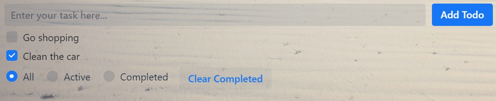

# Build your first web component with Polymer

For further details please see the [lit-html](https://lit-html.polymer-project.org/) and 
[LitElement](https://lit-element.polymer-project.org/) documentation.

In case you want to develop an application based around web components, have a look at the 
[PWA Starter Kit](https://pwa-starter-kit.polymer-project.org/).

## Installation Guide

1.  Install pre-requisites for Polymer CLI (git, npm, Node.js). 

2.  Install Polymer CLI.

        npm install -g polymer-cli@next

3. Install a bash shell. (Optional: Use Git Bash, Cygwin or something similar)

    3.1 Go to _settings_ > _update and security_ > _for developers_ and select _developer mode_.
    
    3.2 From the start menu, search for _turn windows features on or off_ and select _windows subsystem for linux_.
    
    3.3 Restart your computer
    
    3.4 Log in as admin
    
    3.5 Run _Enable-WindowsOptionalFeature -Online -FeatureName Microsoft-Windows-Subsystem-Linux_ in PowerShell
    
    3.6 Go to the microsoft store and download a unix distribution
    
    3.7 Go to your unix command line
    
    3.8 Create a new user (username and password)
    
    3.9 Run bash to install it
    
4.  Change directory to the top-level project folder and install project dependencies.

        cd polymer-3-first-element
        npm install
   
5. Set up a project in the IDE of your choice.

6. Initialize a Polymer 3 element project.

        polymer init polymer-3-element 
        
7. Install the LitElement dependency.

        npm install lit-element
     
8. To preview your element, run the Polymer development server from the top-level project folder.

        polymer serve --open
        
## Tutorial

Web components are a set of web platform APIs that are based on following specifications:

- **Custom Elements:** Lays the foundation for designing and using new types of DOM elements
- **Shadow DOM:** Defines how to use encapsulated style and markup in web components
- **ES Modules:** Defines the inclusion and reuse of JS documents in a standards based, modular, performant way
- **HTML Templates:** Defines how to declare fragments of markup that go unused at page load, but can be instantiated 
later on at runtime

The properties and behaviours of a web component are specified through it's class. _Autonomous custom elements_ normally 
inherit from HTMLElement, while Polymer elements can inherit from the LitElement base class. Besides these autonomous 
custom elements so called _customized built-in elements_ exist, that inherit from a specific DOM element class like 
HTMLButtonElement and can be seen as an extensions for normal HTML5 markup as they are used as a value of the _is_ 
attribute of standard elements.

Web components built a new platform beneath web frameworks, but based on the pure web platform. The mentioned 
technologies the use make them extremely interoperable, reusable and maintainable, which is why they are already used be 
big companies like Google, Netflix or IBM. 

**LitElement** enables the development of lightweight and fast web components due to several optimizations and the usage 
of **lit-html** as a templating engine. For further details please have a look at the [slides](slides.pdf).

Below you can find the basic scheme of a web component built with LitElement:

    import { LitElement, html, css } from 'lit-element';
    export class MyElement extends LitElement {
        
        render() {
            return html`
                //Here comes the markup
            `;
        }
                
        static get styles() {
            return css`
                //Here comes the styling
            `;
        }
        
        static get properties() {
            return {
                //Here comes the properties
            };
        }
        
        constructor() {
            super();
            //Here properties get initialized
        }
    }
    customElements.define('my-element', MyElement);
    
In this tutorial, we will try to built a web component, that looks like the one below:

As you can see, it represents a simple to-do list, where users enter a task to be done, which is then shown in a list of 
tasks beneath. Filtering makes it possible to only display list items that equal to a specific category. Furthermore, 
deleting all completed tasks should be possible.

To start off, we first need to provide the properties that the web component needs to have. 
        
    import { LitElement, html } from 'lit-element';
    export class MyElement extends LitElement {
    
    ...
    
        static get properties() {
            return {
                todos: { type: Array },
                filter: { type: String },
                task: { type: String }
            };
        }
        
    ...
    
    }

Remember that only the types _String, Number, Boolean, Array_ and _Object_ are allowed. There are a bunch of other 
configurations that you can set in the configuration object for each property, like converter functions from attributes 
 to properties and vice versa (see the [slides](slides.pdf)). 

Next, we need to initialize the properties in the constructor with default values, which triggers the first rendering. 
Remember to always call _super()_ in order to get a correct _prototype chain_. 

    import { LitElement, html } from 'lit-element';
    export class MyElement extends LitElement {
    
    ...
    
        constructor() {
            super();
            this.todos = [{task: "Go shopping", complete: false}, {task: "Clean the car", complete: true}];
            this.filter = VisibilityFilters.SHOW_ALL;
            this.task = '';
        }
        
    ...
    
    }

Lit-html is thought to be used as a library for defining render functions as _functions of a state_. This means that 
every time, we change the reference to a value behind a property, LitElement will re-render the web components markup 
parts affected by this change of state. Other parts of the markup than the ones changed won't get touched, which makes 
the web component faster to re-render.

After we have defined and initialized the web components properties, it's time to create the rendering template for the 
web component. Therefore we first need to import several external web components provided by 
[vaadin](https://vaadin.com/components):

        import '@vaadin/vaadin-text-field/vaadin-text-field';
        import '@vaadin/vaadin-button/vaadin-button';
        import '@vaadin/vaadin-checkbox/vaadin-checkbox';
        import '@vaadin/vaadin-radio-button/vaadin-radio-button';
        import '@vaadin/vaadin-radio-button/vaadin-radio-group';
        
Now we can create the template that is later on rendered into the shadow DOM using _tagged template literals_. The 
template literals are tagged with the html parser function provided by lit-html, which parses custom syntax elements to 
native markup. To get an insight into which custom syntax elements and common development patterns like 
_conditionals, loops or directives_ exist, please have a look at the [slides](slides.pdf) or the 
[cheatsheet](cheatsheet.js). The _render_ function returns an instance of _TemplateResult_ which is then appended to the 
shadow DOM. 

    const VisibilityFilters = {
        SHOW_ALL: 'All',
        SHOW_ACTIVE: 'Active',
        SHOW_COMPLETED: 'Completed'
    };

    import { LitElement, html } from 'lit-element';
    export class MyElement extends LitElement {
    
    ...
    
        render() {
            return html`
                

                    <vaadin-text-field
                      placeholder="Enter your task here..."
                      value="${this.task}">
                    </vaadin-text-field>
                    <vaadin-button theme="primary">Add Todo</vaadin-button>
                

                

                ${
                    this.applyFilter(this.todos).map(todo => html`
                      

                        <vaadin-checkbox ?checked="${todo.complete}">${todo.task}</vaadin-checkbox>
                      

                      `;
                    )
                }
                

                <vaadin-radio-group class="visibility-filters" value="${this.filter}">
                ${
                    Object.values(VisibilityFilters).map(filter => html`
                      <vaadin-radio-button value="${filter}">
                        ${filter}
                      </vaadin-radio-button>
                      `;
                    )
                }
                </vaadin-radio-group>
                <vaadin-button >Clear Completed</vaadin-button>`;
        }
        
    ...
    
        applyFilter(todos) {
            switch (this.filter) {
                case VisibilityFilters.SHOW_ACTIVE:
                    return todos.filter(todo => !todo.complete);
                case VisibilityFilters.SHOW_COMPLETED:
                    return todos.filter(todo => todo.complete);
                default:
                    return todos;
            }
        }
    
    }

To dynamically set markup you can use _${}_ to evaluate any JavaScript expression, that returns either a result of a 
primitive type (_String, Number, Boolean_) or an _Array, DOM node_ or even another _TemplateResult_. Remember that due 
to the shadow DOM no styling rules defined outside of the shadow DOM will have an effect on elements inside it, except 
inherited style rules like color or font-size. To still take influence on styling of web components _custom CSS 
properties_ can be defined by a web component developer, that the web component consumer can later on set according to 
his wishes fro outside.

The last thing, that we need to do in order to complete the web component, is to add _EventListeners_ to native or 
custom events. To register event listeners, you could use four different possibilities:

- @<<event-name>>="${(evt) => { ... }}"
- .addEventListener(() => { ... }) in constructor (if event might occur before element has been added to the DOM)
- firstUpdated callback (if event can’t occur before component has been rendered for the first time)
- connectedCallback (if attached to foreign element)

        import { LitElement, html } from 'lit-element';
        export class MyElement extends LitElement {
        
        ...
        
            render() {
                return html`
                    ...
                    <vaadin-text-field
                      placeholder="Enter your task here..."
                      value="${this.task}"
                      @change="${this.updateTask}">
                    </vaadin-text-field>
                    <vaadin-button theme="primary" @click="${this.addTodo}">
                      Add Todo
                    </vaadin-button>
                    ...
                    <vaadin-checkbox
                      ?checked="${todo.complete}"
                      @change="${
                        e => this.updateTodoStatus(todo, e.target.checked)
                      }">
                      ${todo.task}
                    </vaadin-checkbox>
                    ...
                    <vaadin-radio-group
                    class="visibility-filters"
                    value="${this.filter}"
                    @value-changed="${this.filterChanged}">
                    ...
                    <vaadin-button @click="${this.clearCompleted}">
                    Clear Completed
                    </vaadin-button>
                `;
            }
            
        ...
        
            addTodo() {
                if (this.task) {
                    this.todos = [
                        ...this.todos,
                        {
                            task: this.task,
                            complete: false
                        }
                    ];
                    this.task = '';
                }
            }
        
            updateTask(e) {
                this.task = e.target.value;
            }
            
            updateTodoStatus(updatedTodo, complete) {
                this.todos = this.todos.map(todo =>
                    updatedTodo === todo ? { ...updatedTodo, complete } : todo
                );
            }
            
            filterChanged(e) {
                this.filter = e.target.value;
            }
            
            clearCompleted() {
                this.todos = this.todos.filter(todo => !todo.complete);
            }

        }
        
After having finished the web component, we still need to import it to our document! For Edge and Internet Explorer 
some polyfills like _ShadyCSS_ are needed in order to implement missing web platform APIs. 

    
    

That was it! If you did everything correct, your web component should look similar to [this](todo-list/todo-list.js) 
one. Of course this small tutorial only covered the basics. 

Something left to mention would be the possibility to use so called _constructable style sheets_. These will only be 
parsed once, but be applied to all elements having it defined, which separates it from the normal style tags that would 
be parsed for every element. You can use it in a web component created with element like the following: 

    import { css } from 'lit-element';
    
    ...
    
    static get styles() {
        return css`
            //Write your CSS rules here
        `;
    }
 
 Furthermore you can create own custom events like this:
 
    this.dispatchEvent(new CustomEvent('event-name', {
       detail: {
           //Your data to pass
       },
       bubbles: true,
       composed: true 
    }));
 
 But remember to set _bubbles_ to true and _composed_ as well so that the event will break through the boundaries of the 
 shadow DOM. If you would like to have insights into lifecycle functions of the LitElement base class, please have a 
 look at the [slides](slides.pdf).
 
 Now, wow! Do you also think there is lots of potential behind Polymer? Let me know! If you have any questions left, 
 feel free to open an issue!